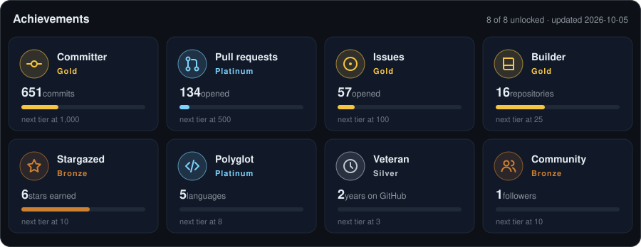

<div align="center">


<p>
  
  
  <a href="https://github.com/s-toufik?tab=repositories"></a>
</p>

</div>

## 👋 About me

I build software the way I'd like to maintain it: **clear layers, small swappable parts, and tests that guard the architecture**. My playground is a homelab that grows into a real platform — an AI agent with its own tools, local language models, full observability and data services, all on a single machine.

- 🧠 Designing **AI agents**: planning, tool use over MCP, self-review, routing driven by explicit rules
- 🏗️ Practising **hexagonal architecture** across Python, TypeScript, Rust and C++
- 📈 Running my own **observability stack**: metrics, logs and traces end to end
- 🌱 Always adding the next piece — the repositories below keep growing

## 🛰️ The homelab platform

```text
              ┌──────────────┐  HTTP / SSE  ┌────────────────────┐   MCP   ┌───────────────┐
  you ──────► │  homelab-ui  │ ───────────► │ agent-orchestrator │ ──────► │ agent-toolbox │
              └──────┬───────┘              └─────┬────────┬─────┘         └───────┬───────┘
                     │                            ▼        ▼                       ▼
                     │                           LLMs   MongoDB          SQL · files · Python
                     ▼
        Grafana · Prometheus · Kafka · …  ◄── telemetry from every service

  everything above runs from homelab-infra · shared foundations come from pycraftcore
```

## 🚀 Featured projects

<table>
  <tr>
    <td width="50%">
      <a href="https://github.com/s-toufik/agent-orchestrator"></a>
    </td>
    <td width="50%">
      <a href="https://github.com/s-toufik/agent-toolbox"></a>
    </td>
  </tr>
  <tr>
    <td width="50%">
      <a href="https://github.com/s-toufik/homelab-ui"></a>
    </td>
    <td width="50%">
      <a href="https://github.com/s-toufik/homelab-infra"></a>
    </td>
  </tr>
  <tr>
    <td width="50%">
      <a href="https://github.com/s-toufik/pycraftcore"></a>
    </td>
    <td width="50%">
      <a href="https://github.com/s-toufik/archetype"></a>
    </td>
  </tr>
</table>

Also building the **pricelab** platform: [pricelab-core](https://github.com/s-toufik/pricelab-core) · [pricelab-retriever](https://github.com/s-toufik/pricelab-retriever)

## 🧰 Tech stack

**Languages**
<br />


**AI & backend**
<br />


**Frontend**
<br />


**Data & infrastructure**
<br />


## 📊 GitHub stats

<div align="center">
  
  
  <br />
  
</div>

## 🏆 Achievements

<div align="center">
  
</div>

## 📅 A year of contributions

<div align="center">
  
  <br /><br />
  <picture>
    <source media="(prefers-color-scheme: dark)" srcset="https://raw.githubusercontent.com/s-toufik/s-toufik/output/github-snake-dark.svg" />
    <source media="(prefers-color-scheme: light)" srcset="https://raw.githubusercontent.com/s-toufik/s-toufik/output/github-snake.svg" />
    
  </picture>
</div>


